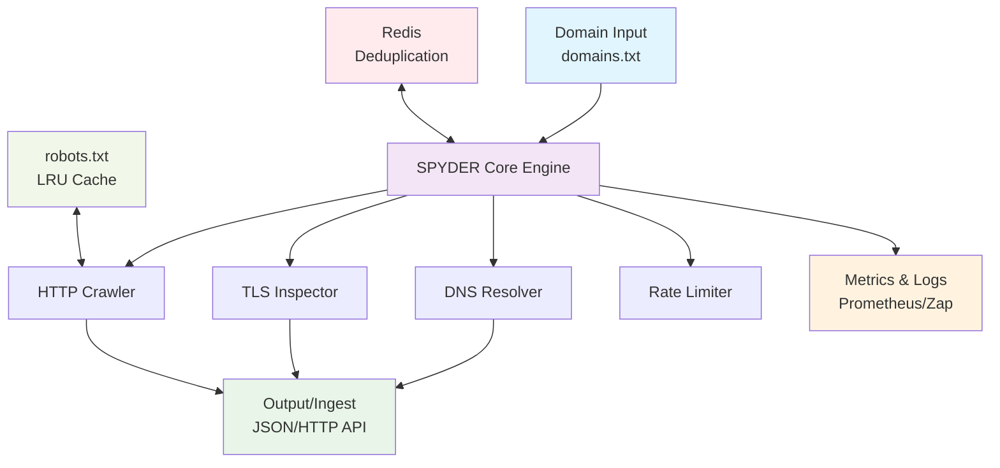

# SPYDER Probe (Project Arachnet) — Production Build

[](https://go.dev/)
[](https://goreportcard.com/report/github.com/GustyCube/spyder)
[](Dockerfile)
[](LICENSE)
[](https://github.com/GustyCube/spyder/issues)
[](CONTRIBUTING.md)


**SPYDER** (System for Probing and Yielding DNS-based Entity Relations) is a high-performance, distributed network reconnaissance tool engineered for mapping inter-domain relationships through DNS resolution, TLS certificate chain analysis, and HTTP link extraction. Built with Go 1.22+, it provides enterprise-grade reliability with structured logging, Prometheus metrics, and policy-aware crawling that respects robots.txt and excludes sensitive TLDs.

## 🏗️ Architecture Overview



---

## 🚀 Technical Capabilities

### Core Engine
- **Multi-Protocol Discovery**: DNS (A, AAAA, CNAME, MX, NS), TLS certificate chain analysis, HTTP link extraction
- **Concurrent Processing**: Configurable worker pool (default: 256 goroutines) with per-host token bucket rate limiting
- **Memory-Efficient Deduplication**: In-memory LRU cache with optional Redis backend for distributed deployments
- **Policy Compliance**: RFC-compliant robots.txt parsing with configurable TLD exclusions (`gov`, `mil`, `int`)

### Observability & Reliability  
- **Structured Telemetry**: [Uber Zap](https://github.com/uber-go/zap) logging with configurable levels and OpenTelemetry traces
- **Prometheus Metrics**: 15+ metrics covering throughput, latency, error rates, and resource utilization
- **Circuit Breaker Pattern**: Exponential backoff with jitter, configurable retry policies
- **Graceful Degradation**: Fault-tolerant batch emission with disk-based spooling for network failures

### Deployment & Integration
- **Cloud-Native**: Distroless container images, Kubernetes-ready health checks
- **Secure Transport**: mTLS support for ingest endpoints with client certificate authentication  
- **Horizontal Scaling**: Redis-backed work queues and deduplication for multi-instance deployments
- **Enterprise Ready**: systemd service files, comprehensive monitoring, structured configuration

---

## ⚡ Quick Start

### Development Build
```bash
# Prerequisites: Go 1.22+, ~256MB RAM, 1GB disk
make build  # or: go build -o bin/spyder ./cmd/spyder

# Basic reconnaissance scan
echo -e "example.com\ngithub.com\ncloudflare.com" > domains.txt
./bin/spyder -domains=domains.txt -concurrency=64
```

### Production Deployment
```bash
# High-throughput setup with Redis deduplication
REDIS_ADDR=127.0.0.1:6379 ./bin/spyder \
  -domains=domains.txt \
  -ingest=https://ingest-api.internal/v1/batch \
  -metrics_addr=:9090 \
  -probe=prod-us-east-1 \
  -concurrency=512 \
  -batch_max_edges=50000 \
  -mtls_cert=/etc/ssl/client.pem \
  -mtls_key=/etc/ssl/client.key
```

### Docker Deployment
```bash
docker build -t spyder-probe:latest .
docker run --rm \
  -v $(pwd)/domains.txt:/domains.txt \
  -v $(pwd)/output:/spool \
  -e REDIS_ADDR=redis:6379 \
  spyder-probe:latest \
  -domains=/domains.txt -metrics_addr=:9090
```

---

## 🔧 Configuration Reference

### Runtime Parameters

| Parameter | Type | Default | Description |
|-----------|------|---------|-------------|
| `-domains` | `string` | **required** | Path to newline-delimited domain list |
| `-concurrency` | `int` | `256` | Worker goroutines (tune to CPU cores × 64) |
| `-probe` | `string` | `local-1` | Unique probe identifier for distributed setups |
| `-run` | `string` | `run-{timestamp}` | Run identifier for batch correlation |
| `-ua` | `string` | `SPYDERProbe/1.0` | HTTP User-Agent header |

### Performance & Rate Limiting

| Parameter | Type | Default | Description |
|-----------|------|---------|-------------|
| `-batch_max_edges` | `int` | `10000` | Maximum edges per output batch |
| `-batch_flush_sec` | `int` | `2` | Batch flush interval (seconds) |
| `-exclude_tlds` | `string` | `gov,mil,int` | Comma-separated TLD exclusions |

### Networking & Security

| Parameter | Type | Default | Description |
|-----------|------|---------|-------------|
| `-ingest` | `string` | `stdout` | HTTP(S) ingest endpoint URL |
| `-mtls_cert` | `string` | `""` | Client certificate for mTLS authentication |
| `-mtls_key` | `string` | `""` | Client private key for mTLS |
| `-mtls_ca` | `string` | `""` | CA certificate bundle for mTLS |

### Observability

| Parameter | Type | Default | Description |
|-----------|------|---------|-------------|
| `-metrics_addr` | `string` | `:9090` | Prometheus metrics bind address |
| `-spool_dir` | `string` | `spool/` | Directory for failed batch persistence |
| `REDIS_ADDR` | `env` | `""` | Redis server for distributed deduplication |
| `REDIS_QUEUE_ADDR` | `env` | `""` | Redis server for work queue distribution |
| `REDIS_QUEUE_KEY` | `env` | `spyder:queue` | Redis key for work queue |

## 📊 Performance Metrics

### Throughput Benchmarks
```
Hardware: 4-core CPU, 8GB RAM, SSD storage
Redis: Local instance, default configuration

Domains: 10,000 | Workers: 256 | Rate: ~847 domains/sec
Domains: 50,000 | Workers: 512 | Rate: ~1,205 domains/sec  
Edges Generated: ~2.3M edges/hour | Memory: ~512MB peak
```

### Output Data Schema
```json
{
  "probe_id": "prod-us-east-1",
  "run_id": "run-1704067200",
  "batch_id": "b7f3c4e8",
  "timestamp": "2024-01-01T10:30:00Z",
  "nodes_domain": [
    {
      "host": "example.com",
      "apex": "example.com", 
      "first_seen": "2024-01-01T10:30:00Z",
      "last_seen": "2024-01-01T10:30:00Z"
    }
  ],
  "nodes_ip": [
    {
      "ip": "93.184.216.34",
      "first_seen": "2024-01-01T10:30:00Z", 
      "last_seen": "2024-01-01T10:30:00Z"
    }
  ],
  "nodes_cert": [
    {
      "sha256": "a1b2c3...",
      "subject": "CN=*.example.com",
      "issuer": "DigiCert Inc",
      "not_before": "2023-01-01T00:00:00Z",
      "not_after": "2024-12-31T23:59:59Z"
    }
  ],
  "edges": [
    {
      "type": "RESOLVES_TO",
      "source": "example.com", 
      "target": "93.184.216.34",
      "observed_at": "2024-01-01T10:30:00Z",
      "probe_id": "prod-us-east-1",
      "run_id": "run-1704067200"
    }
  ]
}
```

## 🔍 Monitoring & Observability

### Key Prometheus Metrics
```promql
# Processing throughput
spyder_tasks_total{status="ok"}

# Edge discovery rate by type  
rate(spyder_edges_total{type="RESOLVES_TO"}[5m])

# Error rates and latency
spyder_http_request_duration_seconds{quantile="0.95"}
rate(spyder_tasks_total{status="error"}[5m]) / rate(spyder_tasks_total[5m])

# Resource utilization
spyder_active_workers
spyder_redis_operations_total{operation="hit"}
```

### Log Analysis Examples
```bash
# High-level operational stats
journalctl -u spyder | jq 'select(.msg == "batch emitted") | .edges_count' | jq -s 'add'

# DNS resolution performance  
journalctl -u spyder | jq 'select(.component == "dns") | {host, duration_ms, record_count}'

# Rate limiting events
journalctl -u spyder | jq 'select(.msg | contains("rate limit"))'
```

## 🏭 Production Deployment Patterns

### High-Availability Setup
```bash
# Load balancer + multiple probe instances
# Instance 1: US-East
REDIS_ADDR=redis-cluster:6379 ./bin/spyder \
  -probe=us-east-1 -concurrency=256 \
  -domains=/shared/domains-shard-1.txt

# Instance 2: US-West  
REDIS_ADDR=redis-cluster:6379 ./bin/spyder \
  -probe=us-west-1 -concurrency=256 \
  -domains=/shared/domains-shard-2.txt
```

### Kubernetes Deployment
```yaml
apiVersion: apps/v1
kind: Deployment
metadata:
  name: spyder-probe
spec:
  replicas: 3
  selector:
    matchLabels:
      app: spyder-probe
  template:
    spec:
      containers:
      - name: spyder
        image: spyder-probe:v1.0.0
        resources:
          requests:
            memory: "512Mi"
            cpu: "500m"
          limits:
            memory: "2Gi" 
            cpu: "2000m"
        env:
        - name: REDIS_ADDR
          value: "redis-service:6379"
```

## 🧰 Integration Examples

### Kafka Integration
```bash
# Stream edges to Kafka topic
./bin/spyder -domains=domains.txt \
  -ingest=http://kafka-connect:8080/topics/network-edges
```

### Elasticsearch Ingestion  
```bash
# Direct to Elasticsearch via HTTP
./bin/spyder -domains=domains.txt \
  -ingest=https://elasticsearch:9200/network-intel/_bulk \
  -mtls_cert=/certs/elastic-client.pem
```

### Custom Processing Pipeline
```bash
# Named pipes for real-time processing
mkfifo /tmp/spyder-stream
./bin/spyder -domains=domains.txt > /tmp/spyder-stream &
cat /tmp/spyder-stream | jq '.edges[]' | custom-processor
```

---

## 📚 Documentation

- **[Installation Guide](docs/guide/installation.md)** - Production setup and deployment
- **[Operations Manual](docs/ops/)** - Monitoring, troubleshooting, performance tuning
- **[Architecture Deep-Dive](docs/)** - Technical specifications and design decisions

### Local Development
```bash
cd docs && npm install && npm run docs:dev
# → http://localhost:5173
```

---

## 🤝 Contributing

See [CONTRIBUTING.md](CONTRIBUTING.md) for development setup, coding standards, and contribution guidelines.

**Quick Development Setup:**
```bash
git clone https://github.com/gustycube/spyder-probe.git
cd spyder-probe
make lint test build
./bin/spyder -domains=configs/test-domains.txt
```

---

## 📄 License

Licensed under the MIT License. See [LICENSE](LICENSE) for details.
